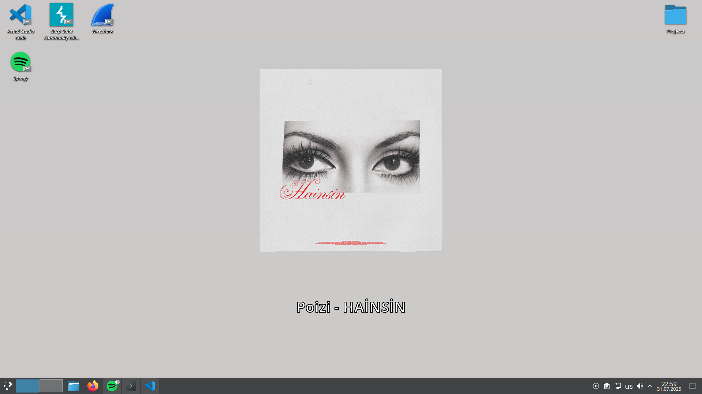

<h1 style="color:#333;">🎵 Spotify Wallpaper for KDE Plasma</h1>

<strong>Spotify Wallpaper</strong> is a lightweight Bash script that automatically sets your desktop wallpaper to the currently playing Spotify track’s album cover with song and artist info, tailored for KDE Plasma users.

<blockquote style="color:#666; border-left:4px solid #ccc; padding-left:1em;">
If you love listening to music and want your desktop to reflect your current vibe, this tool is for you.
</blockquote>

<h2 style="color:#333;">✨ Features</h2>
<ul>
  <li>🎨 Downloads the current album cover from Spotify</li>
  <li>🖋️ Overlays the artist and song title on the image</li>
  <li>🔁 Updates automatically when the song changes</li>
  <li>🧼 Cleans up old wallpaper files automatically</li>
  <li>🐧 Fully compatible with KDE Plasma via <code>qdbus</code></li>
</ul>

<h2 style="color:#333;">🖥️ Screenshot</h2>

<h2 style="color:#333;">⚙️ Requirements</h2>
<table style="border-collapse: collapse; width: 100%;">
  <thead>
    <tr>
      <th style="border:1px solid #ddd; padding:8px;">Package</th>
      <th style="border:1px solid #ddd; padding:8px;">Purpose</th>
    </tr>
  </thead>
  <tbody>
    <tr>
      <td style="border:1px solid #ddd; padding:8px;"><code>playerctl</code></td>
      <td style="border:1px solid #ddd; padding:8px;">Get metadata from Spotify</td>
    </tr>
    <tr>
      <td style="border:1px solid #ddd; padding:8px;"><code>wget</code></td>
      <td style="border:1px solid #ddd; padding:8px;">Download the album cover</td>
    </tr>
    <tr>
      <td style="border:1px solid #ddd; padding:8px;"><code>imagemagick</code></td>
      <td style="border:1px solid #ddd; padding:8px;">Edit and compose the final image</td>
    </tr>
    <tr>
      <td style="border:1px solid #ddd; padding:8px;"><code>qdbus</code></td>
      <td style="border:1px solid #ddd; padding:8px;">Change KDE wallpaper</td>
    </tr>
  </tbody>
</table>

<h2 style="color:#333;">🚀 Installation</h2>
<pre style="background:#f4f4f4; padding:1em; border-radius:4px;"><code>git clone https://github.com/hudulovhamzat0/spotify-wallpaper.git
cd spotify-wallpaper
bash install.sh
</code></pre>

The script will be copied to <code>~/.local/bin/spotify-wallpaper.sh</code> for easy access.

<h2 style="color:#333;">▶️ Usage</h2>

To start the script, run:

<pre style="background:#f4f4f4; padding:1em; border-radius:4px;"><code>bash ~/.local/bin/spotify-wallpaper.sh</code></pre>

It checks every 5 seconds for a new song and updates your KDE wallpaper accordingly.

<blockquote style="color:#666; border-left:4px solid #ccc; padding-left:1em;">
You can also add it to your KDE Startup Applications to run on login.
</blockquote>

<h2 style="color:#333;">🛠️ Customization</h2>

<h3 style="color:#444;">🎚 Font</h3>

The default font used is <code>DejaVuSans-Bold</code>. If <code>OpenSans-Bold</code> is installed, it will automatically be used instead.

<h3 style="color:#444;">🖋️ Text Wrapping</h3>

The text is center-aligned, with a 40-character word-wrapped layout to fit nicely under the album cover.

<pre style="background:#f4f4f4; padding:1em; border-radius:4px;"><code>TEXT="$ARTIST - $TITLE"
FORMATTED_TEXT=$(echo "$TEXT" | fold -s -w 40)</code></pre>

<h2 style="color:#333;">🐞 Debugging</h2>

All debug logs are written to:

<pre style="background:#f4f4f4; padding:1em; border-radius:4px;"><code>/tmp/spotify_wallpaper_debug.log</code></pre>

<h2 style="color:#333;">💡 Planned Features</h2>
<ul>
  <li>[ ] Dynamic resolution detection</li>
  <li>[ ] KDE Plasma 6 compatibility</li>
  <li>[ ] Auto background gradient from album art</li>
</ul>

<h2 style="color:#333;">🤝 Contributing</h2>

Contributions are welcome! Feel free to fork the repo, make improvements, and submit a pull request.

Open issues or feature suggestions via the <a href="https://github.com/hudulovhamzat0/spotify-wallpaper/issues">Issue Tracker</a>.

<h2 style="color:#333;">📄 License</h2>

This project is licensed under the <a href="https://opensource.org/licenses/MIT">MIT License</a>. You can use, distribute, and modify it freely.

<h2 style="color:#333;">🙏 Thanks</h2>
<blockquote style="color:#666; border-left:4px solid #ccc; padding-left:1em;">
This script was built to enhance your music experience by bringing album visuals to your KDE desktop.  
“If music feeds the soul, why not let your desktop feed on it too?” 🎧
</blockquote>

</body>
</html>
